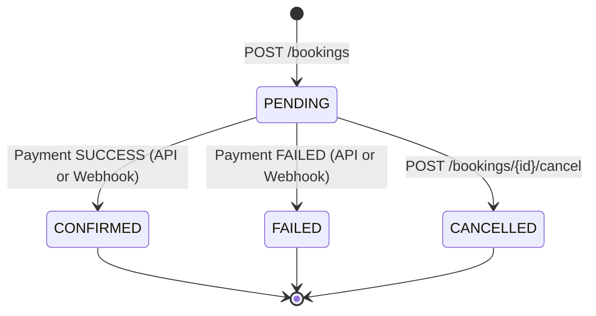

# EVE Healthcare System Architecture & Design Notes

This document provides a detailed overview of the system architecture, design decisions, data flow, and resilience mechanisms implemented for the EVE Healthcare backend service.

---

## 1. System Architecture Overview

The system follows a clean, layered architecture ensuring separation of concerns, testability, and maintainability:

```text
       HTTP Requests (REST / JSON / Form)
                      │
                      ▼
         ┌─────────────────────────┐
         │     FastAPI Layer       │
         │  - CORS Middleware      │
         │  - Request Logging      │
         │  - Rate Limiter (429)   │
         │  - Routing & Validation │
         └────────────┬────────────┘
                      │
         ┌────────────▼────────────┐
         │   Dependencies & Auth   │
         │  - JWT Bearer Token     │
         │  - Role Verification    │
         │  - DB Session Injector  │
         └────────────┬────────────┘
                      │
         ┌────────────▼────────────┐
         │     Service Layer       │
         │  - booking_service.py   │
         │  - payment_service.py   │
         │  - Idempotency & State  │
         └────────────┬────────────┘
                      │
         ┌────────────▼────────────┐
         │  SQLAlchemy 2.0 ORM     │
         │  - Models & Mapping     │
         │  - Foreign Keys & Index │
         └────────────┬────────────┘
                      │
       ┌──────────────┴──────────────┐
       ▼                             ▼
┌──────────────┐              ┌──────────────┐
│  PostgreSQL  │              │ Redis Cache  │
│ (Persistent) │              │ (In-memory)  │
└──────────────┘              └──────────────┘
```

---

## 2. Booking State Machine

Bookings transition strictly through well-defined lifecycle states:



### State Invariants:
1. **Server-Side Pricing**: The client cannot supply a booking amount. The amount is derived strictly from the verified test price in the database.
2. **Centre Consistency**: A booking is rejected if the requested diagnostic test does not belong to the selected diagnostic centre.
3. **Future Appointments**: Appointments must be in the future. Both naive and timezone-aware ISO datetimes are normalized safely.
4. **Terminal States**: `CONFIRMED`, `FAILED`, and `CANCELLED` are terminal states. A cancelled booking cannot receive payments. A confirmed booking cannot be transitioned to failed by an out-of-order webhook event.

---

## 3. Payment & Webhook Idempotency Strategy

Idempotency guarantees that executing the same operation multiple times produces the exact same side-effect and return value as executing it once.

### Simulated Payment Idempotency (`POST /payments/`):
1. **Idempotency Key Check First**: The system checks if `idempotency_key` (supplied via JSON body or `Idempotency-Key` header) has already been processed:
   - If an existing payment with this key exists for the **same booking**: Returns the existing payment immediately (`HTTP 201 Created`).
   - If an existing payment with this key exists for a **different booking**: Rejects with `HTTP 409 Conflict`.
2. **One-to-One Payment Constraint**: Each booking has at most one payment record enforced by a unique database foreign key constraint (`bookings.id` unique in `payments`).

### Payment Webhook Idempotency (`POST /payments/webhook/`):
1. **Event Deduplication**: The simulated payment provider delivers an `event_id`.
2. **Webhook Audit Table**: Incoming events are recorded in `webhook_events` with `event_id` (unique index), `provider_payment_id`, `booking_id`, `status`, and `retry_count`.
3. **Replay Safety**: If an event with the same `event_id` is replayed:
   - The retry counter is incremented for observability.
   - The previously processed payment record is returned immediately.
   - No duplicate payment or duplicate booking is created.
   - The booking state is protected from corruption.

---

## 4. Key Engineering Decisions & Interview Talking Points

1. **Security & Ownership**: Normal patients can only view or cancel their own bookings. Centre and test catalog modifications require admin privileges (`is_admin=True`).
2. **Database-Enforced Integrity**: Critical business rules (uniqueness of emails, event IDs, idempotency keys, and 1-to-1 payment mappings) are enforced at the database layer using unique constraints, not solely in application code.
3. **Multi-Model Caching**: The catalog caching utility connects to Redis when `REDIS_URL` is configured, while transparently falling back to an in-memory TTL cache when Redis is absent.
4. **Graceful Timezone Handling**: All database timestamps and business comparisons use timezone-aware UTC (`datetime.now(timezone.utc)`), preventing timezone drift and eliminating Python 3.12 deprecation warnings.
5. **Rate Limiting**: Critical endpoints (login and payments) are protected against abuse using a sliding-window rate limiter returning standard `HTTP 429` and `Retry-After` headers.
